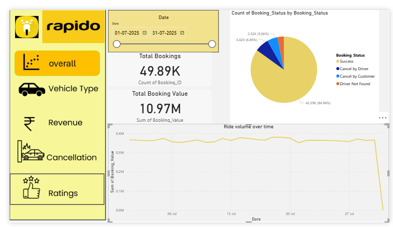

# 🚦 Rapido Hyderabad Data Analysis Project

This project analyzes over **100,000 ride bookings** from Rapido in Hyderabad using **SQL** and **Power BI** to uncover ride trends, customer behavior, peak hours, and business insights.

---

## 📁 Project Structure

| Folder      | Description                            |
|-------------|----------------------------------------|
| `data/`     | Cleaned ride booking dataset (`.xlsx`) |
| `sql/`      | SQL queries and analysis scripts        |
| `powerbi/`  | Power BI dashboard (`.pbix` format)     |
| `images/`   | Dashboard screenshot for visual preview |

---

## 📁 Project Files

- [`Rapido_hyderabad.xlsx`](data/Rapido_hyderabad.xlsx) – Cleaned dataset  
- [`rapido_project_sql.sql`](sql/rapido_project_sql.sql) – All SQL views and queries  
- [`Download Power BI Dashboard (.pbix)`](powerbi/rapido_hyderabad.pbix) – Final dashboard  
- [`dashboard_screenshot.png`](images/dashboard_screenshot.png) – Dashboard preview

---

## 🔍 SQL Analysis Highlights

✅ Created views for:
- All successful bookings  
- Average ride distance by vehicle type  
- Total rides cancelled by customers  
- Top 5 customers by booking frequency  
- Peak booking hours  
- Payment method analysis  

---

## 📊 Power BI Dashboard Features

- 📅 **Daily, Weekly, and Peak Hour Trends**
- 🌐 **Vehicle Type Performance**
- ❌ **Cancellation Patterns**
- ⭐ **Customer & Driver Ratings**
- 💰 **Revenue Insight by Time & Type**

---

## 📈 Key Insights

- 📅 **17% higher bookings** on weekends & cricket match days  
- 🛺 **Autos and Bikes** account for over **60% of total ride value** during peak hours  
- 💵 **Cash and UPI** dominate payment methods  
- 🕒 Peak ride demand between **8 AM – 11 AM** and **6 PM – 9 PM**

---

## ⚙️ Tools & Tech Used

- **SQL (MySQL Workbench)** – For querying and KPIs  
- **Power BI** – Interactive dashboard  
- **Excel & Google Colab** – Data cleaning and preprocessing  

---

## 📸 Dashboard Preview

---

## 🚀 Next Steps

- 📈 Predictive Modeling: Forecast ride demand using ML  
- 🤖 Gen AI: Auto-generate insights and customer ride summaries  
- 📱 Mobile-first optimization for dashboard interface  

---

## 👋 Connect with Me

📬 [LinkedIn](https://www.linkedin.com/in/udayyellanki)  
📧 udayyellanki09@gmail.com  
